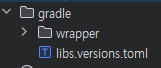

## version catalogs 추가

프로젝트를 처음 시작할 당시만 해도 Library의 버전들을 관리해주는 버전 카탈로그 파일 `libs.version.toml`이 따로 추가되지 않았었다.

우선 프로젝트 내의 `Library`들의 **_Dependency_** 들을 버전 카탈로그에서 관리하기위해 `libs.versions.toml`파일을 생성한 뒤, 당장 판단이 가능한 Dependency들을 정리했다. 



``` toml
[versions]
activityKtx = "1.9.3"
...

[libraries]
activity-ktx = { module = "androidx.activity:activity-ktx", version.ref = "activityKtx" }
...

[plugins]
```

<br>

[[이전으로]](../README.md)